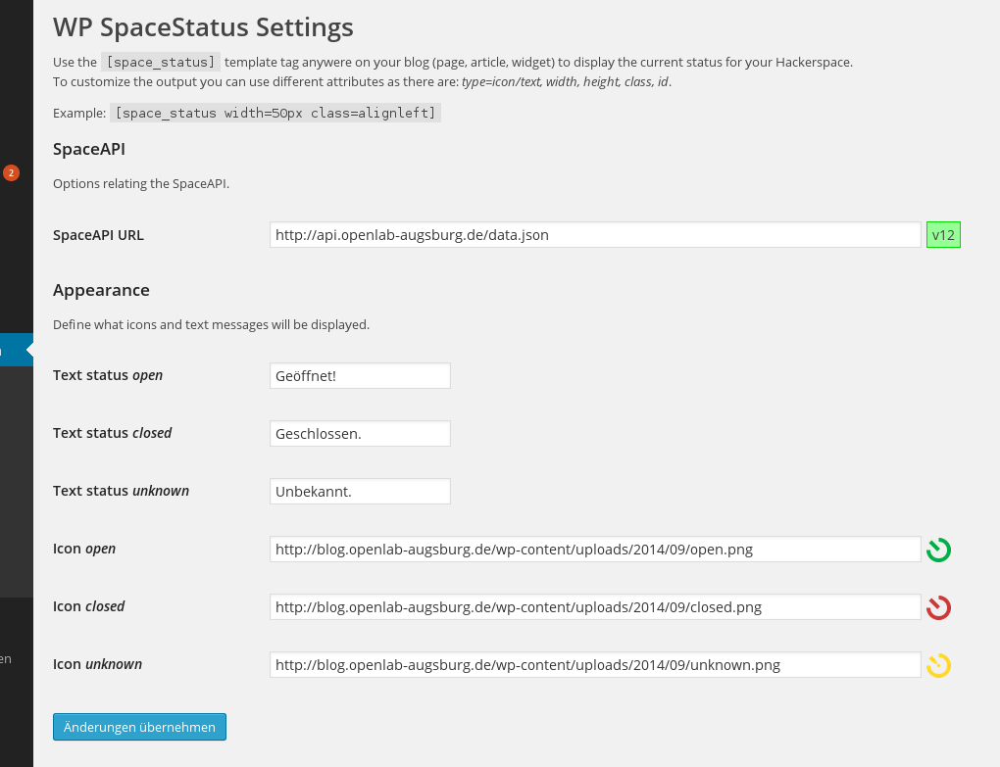

WP SpaceStatus
==============

A simple WordPress SpaceAPI plugin that provides a template tag to display the space status.



**Features**
  * Calls SpaceAPI server-side, no JavaScript required.
  * Customizable template tag to display an icon or a text state.
  * Plugin settings page to set the SpaceAPI and output options.
  * Setting to use SpaceAPI or manually set icons
  * Setting to force protocol-relative image-URLs
  * Widget to display SpaceAPI Status

**To be implemented**
  * Make use of WordPress´ media uploader to upload icons.


#Usage

Just put the short code anywere on your WordPress page (e.g. article, page, widget) to display the space status.

**Attributes**
```
type=icon/text, width, height, class, id
```
**Examples**
```
[space_status]
[space_status type=text]
[space_status type=icon width=50px class=alignleft]
[space_lastchange]
```
